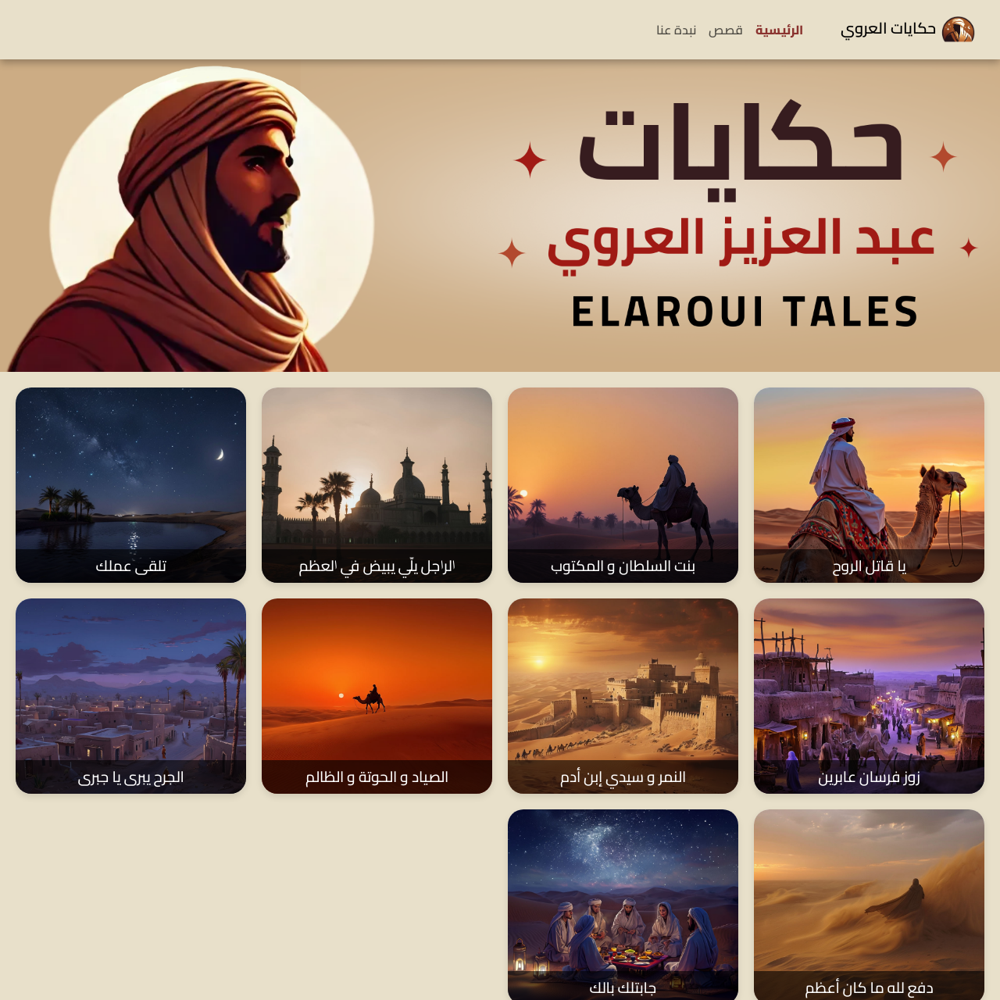
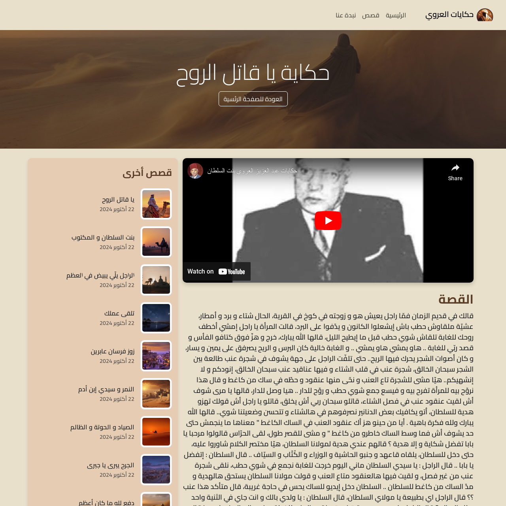

The El Aroui Stories application is a user-friendly website built using Angular. It interacts seamlessly with the El Aroui Stories API to provide users with access to captivating stories. Let’s explore the main features:

## 1. Home Screen
The home screen displays a list of stories obtained from the `/stories` endpoint. Each story entry includes the title, publication date, and a brief excerpt of the story content.

## 2. Story Details Page
When a user clicks on a story title, it opens the story details page, utilizing the `/stories/:id` endpoint. This page showcases the complete story text along with an embedded YouTube video.

## 3. Responsive Design
The website is designed to be responsive, ensuring a smooth experience on both desktop and mobile devices. Users can enjoy the storytelling experience regardless of their device.

## 4. Easy Navigation
The application provides easy navigation between the home screen and the story details. Users can quickly return to the list of stories or view additional stories by clicking the respective links.

## Example Website
The El Aroui Stories website is hosted at [Elaroui Tales](https://elarouitales.netlify.app). Users can explore the home screen, view story details, and enjoy the rich storytelling experience.
